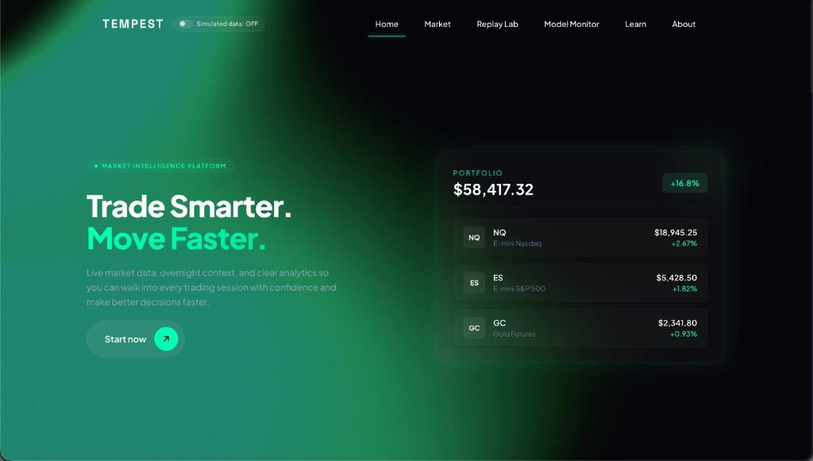
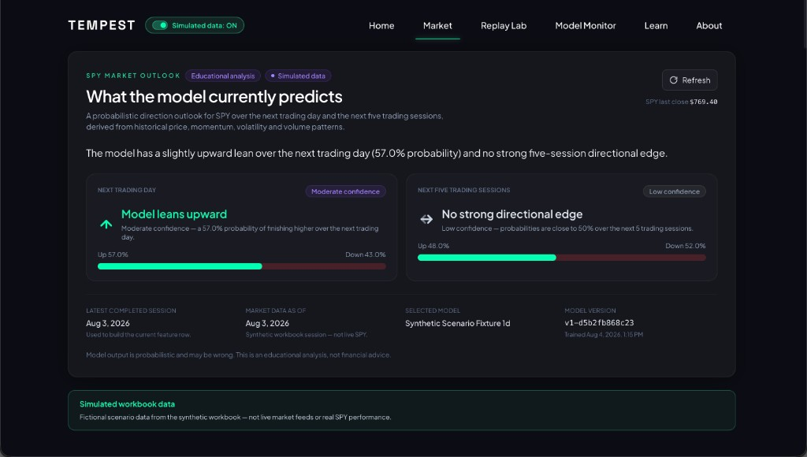
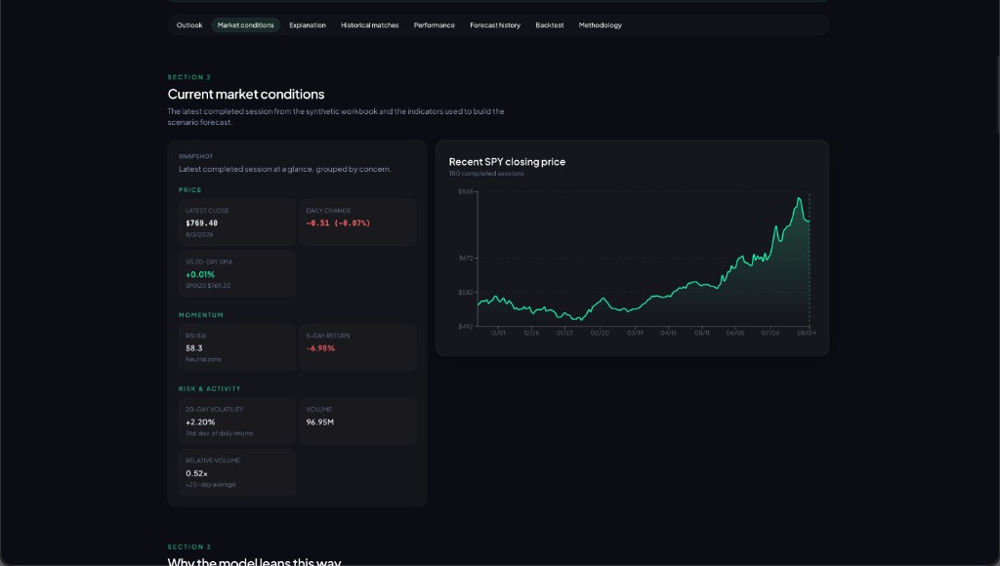
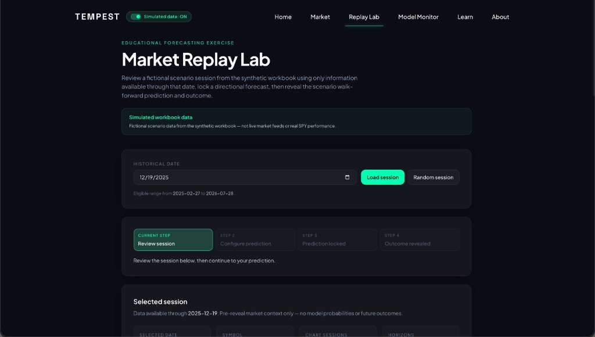
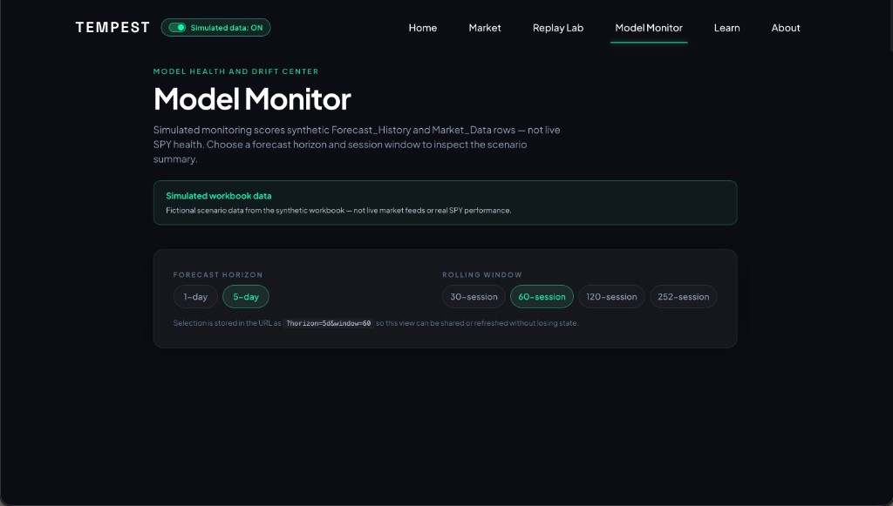
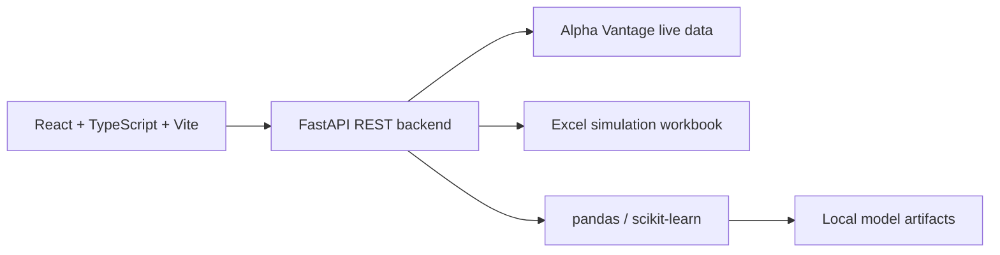

# Tempest

Tempest is a full-stack market intelligence and machine-learning dashboard that combines live SPY market data or explicitly enabled Excel simulation data with explainable forecasts, historical replay, and model monitoring.

## Project Overview

Tempest generates educational one-day and five-session SPY directional forecasts. The frontend is React and TypeScript; the backend is FastAPI with pandas and scikit-learn.

Users can explicitly switch between live Alpha Vantage data and fictional Excel workbook simulation data. Simulated mode is opt-in and never activates automatically when live data fails. The Market Replay Lab supports reviewing historical sessions, locking predictions, and revealing outcomes. The Model Monitor evaluates forecast behavior across horizons and rolling windows.

Forecasts are probabilistic and educational. Features are built to avoid look-ahead leakage, and the Alpha Vantage API key stays backend-only.

## Key Features

- Explainable one-day and five-session forecasts
- Current market indicators and historical price charts
- Market Replay Lab with locked predictions and revealed outcomes
- Model monitoring across forecast horizons and rolling windows
- Live Alpha Vantage mode and clearly labeled Excel simulation mode

## Project Preview



<table>
  <tr>
    <td align="center" width="50%">
      
      <br />
      <sub>Explainable Market Outlook</sub>
    </td>
    <td align="center" width="50%">
      
      <br />
      <sub>Current Market Conditions</sub>
    </td>
  </tr>
  <tr>
    <td align="center" width="50%">
      
      <br />
      <sub>Market Replay Lab</sub>
    </td>
    <td align="center" width="50%">
      
      <br />
      <sub>Model Monitor</sub>
    </td>
  </tr>
</table>

## Architecture



## Tech Stack

**Frontend:** React, TypeScript, Vite, Tailwind CSS, TanStack Query, Recharts

**Backend and Machine Learning:** Python, FastAPI, Pydantic, pandas, scikit-learn, openpyxl, HTTPX

**Testing and Tooling:** Vitest, Testing Library, MSW, pytest, Ruff, Docker

## Local Setup

**Requirements:** Node.js 20+, Python 3.11+. An Alpha Vantage API key is optional for simulated mode and required for live market data.

```bash
git clone https://github.com/tangdarren/stock-market-dashboard.git
cd stock-market-dashboard

npm install

python3.11 -m venv server/.venv
source server/.venv/bin/activate
pip install -e "server/.[dev,bootstrap]"

cp server/.env.example server/.env
```

For live Alpha Vantage mode, set:

```bash
ALPHA_VANTAGE_API_KEY=your_key
```

Start the servers in two terminals:

```bash
# Terminal 1: FastAPI backend
make dev-backend

# Terminal 2: React frontend
npm run dev
```

Open [http://localhost:5173](http://localhost:5173). Port 8000 must be available for FastAPI.

Simulated mode works without an Alpha Vantage API key. Enable it with the visible **Simulated data** switch; live Alpha Vantage mode remains the default when simulation is off.

For live model forecasts, bootstrap history and train local artifacts once:

```bash
make bootstrap
make train
```

## Testing

```bash
npm run typecheck
npm run lint
npm test
npm run build
make test-backend
```

## Documentation

- [`docs/MODEL_CARD.md`](docs/MODEL_CARD.md) — models, metrics, and limitations
- [`docs/DATA_CARD.md`](docs/DATA_CARD.md) — data provenance and conventions

## Disclaimer and License

Forecasts are probabilistic and educational. This project does not provide financial advice. Simulated workbook data is fictional and clearly labeled. The Alpha Vantage API key remains backend-only.

Licensed under the [MIT License](LICENSE).
